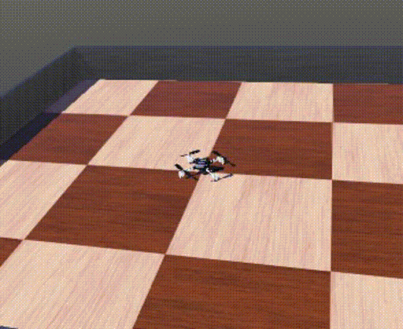

# crazyflie_simulation

Hi! Welkom to the crazyflie simulation repo. This repo is still at the early stages and still in development so just ask if you are looking for anything in particular.

Currently it contains low resolution meshes based on the design of the actual [crazyflie 2.1](https://www.bitcraze.io/products/crazyflie-2-1/) but heavily simplified to contain as little vertices as possible, so it can be used to simulate a lot of them!

## Content

Currently contains:
* Meshes
    * Blender files
    * STL files
* [Webots](https://cyberbotics.com/) simulation files
    * Currently with velocity control fixed height and firmware python bindings
    * Camera and multiranger sensors
* [Gazebo](https://gazebosim.org/) 
    * sdf files
    * no control yet

So the mesh files looks a bit like this:

And the webots simulation looks like this:

Near future plans:

Wish list (?):
* SITL and or HITL
* Simple physics model
* Deck models
* Intergration with Crazyflie-lib
* ?? (let us know in the issue tracker for any feature requests)

# Webots

Install webots from the [cyberbotics' website](https://cyberbotics.com/). We use version 2023a version.

Then just run the following

    webots webots/worlds/crazyflie_world.wbt

## Chhange controller

In webots, change controller to either `crazyflie_controller_c` or `crazyflie_controller_py` to try out a simple controller in different languages

## Firmware python bindings
As of this [Pull request in the Crazyflie firmware repo](https://github.com/bitcraze/crazyflie-firmware/pull/1021) it is possible to use the python bindings of the controllers of the actual crazyflie controller directly in webots.

Go the crazyflie-firmware directory in a terminal and write:

    make bindings_python

Change the controller in the crazyflie robot model in webots to crazyflie_controller_py_firmware_pid, and adjust the following line to point to your crazyflie-firmware repo:

    sys.path.append('../../../../../C/crazyflie-firmware')

Press play with the simulator and use your keyboard to  control it 

# Gazebo

*Just mind that this model does not fly properly yet.* 

1- First install gazebo garden: https://ignitionrobotics.org/docs/garden/install

2- Clone this repo: 
    git clone https://github.com/bitcraze/crazyflie_simulation.git

3- Put this repo in your ~/.bashrc and source it in your terminal

    export IGN_GAZEBO_RESOURCE_PATH="path/to/crazyflie-simulation/gazebo-ignition/"

*Note that indeed this is still IGN_GAZEBO_RESOURCE_PATH, eventhough gazebo dropped the name IGN so this should be updated at one point*

4- Try out the crazyflie world with: 
    gz sim crazyflie_world.sdf

5- Spin motors 

    gz topic -t /crazyflie/gazebo/command/motor_speed --msgtype ignition.msgs.Actuators -p 'velocity:[250,250,250,250]'

## Measurements Crazyflie Assembly

The location of the parts

* Propeller origin from center (0.031, 0.031, 0.022) m
    * Mirrored in the x and y axis
* Motor mount + motor mounts (0.031, 0.031, 0.014) m
    * Mirrored in the x and y axis
* Body origin height from center ( 0, 0, 0.015) m
* Battery holder height ( 0, 0,0.025) m
* Battery height (0,0,0.02) m
* Pin headers (0, 0.011, 0.014) m
    * Mirrored in the y axis
